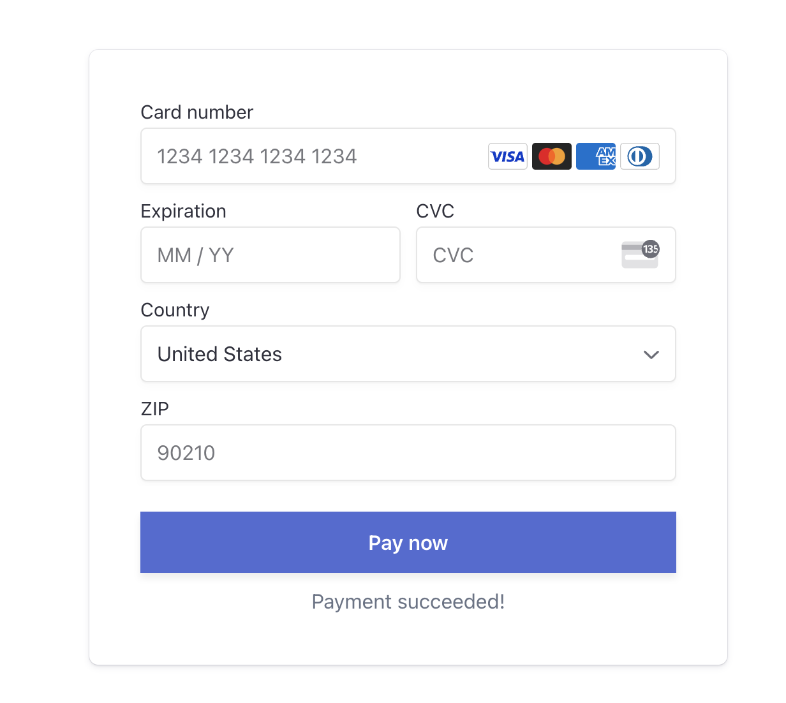
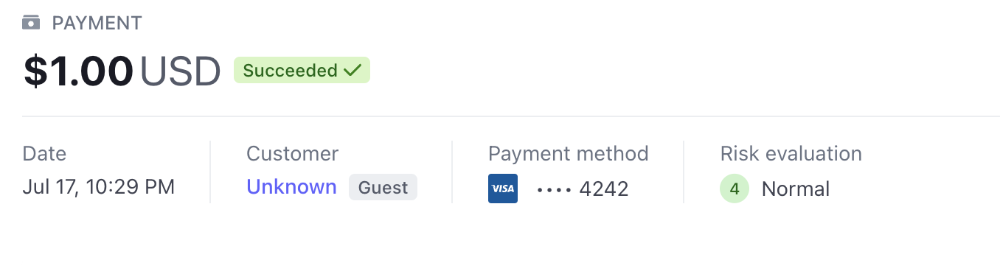

# go-stripe
[Stripe](https://stripe.com/) is a great start up focusing on building `payment infrastructure` for the Internet. To understand what they can offer better, this is a toy app to demonstrate some features of stripe APIs. Of course what `Stripe` can provide is way more than what are demonstrated here but hopefully this app could give you a sense about there business ambitions.

# stripe API features to demostrate
- [x] stripe product creation/deletion
- [x] credit card payments (UI + validation callback)

# screenshots
## payment UI

## successful payment


# notes about this app
- [x] this app is built on top of [simple-gço-server](https://github.com/uitachi123/simple-go-server) which is a working scaffolding of `golang` server with `react` UI
- [x] app is ready to run with your stripe API token
- [x] the development of this app refers to stripe docs [payments](https://stripe.com/docs/payments)

# clean, test, build
```
make all
```

# run
TOKEN=<sk*** - your stripe API Secret key> REACT_TOKEN=<pk*** - you stripe API Publishable key> make serve

# testing credit card number
[testing number](https://stripe.com/docs/testing#testing-interactively)
